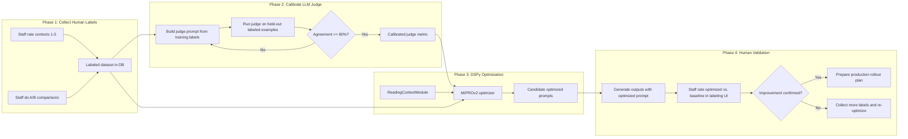

# DSPy Prompt Optimization for Reading Context Generation

Optimize the LLM prompt used to generate contextual summaries for daily Bible readings. Instead of manually iterating on prompt text, this project uses human preference data to calibrate an automated judge, then runs DSPy's MIPROv2 optimizer to systematically discover better prompt instructions and few-shot examples.

This document set is scoped for a **local first proof of concept** in `bahk`. The goal of the first pass is to prove that the optimization loop is useful on a local copy of the app and its data, not to define a cloud deployment or production rollout procedure yet.

## Overall Flow

Humans are in the loop at the **input** (Phase 1 -- calibrating what "good" means) and the **output** (Phase 4 -- validating the result). The expensive inner optimization loop (Phase 3) uses a fast LLM judge as a proxy, which must be calibrated on a training subset and evaluated on a held-out subset in Phase 2.

## Local PoC Boundaries

- Run everything against the local `bahk` development environment and local database first.
- Follow the repo's containerized workflow from `bahk/CLAUDE.md`: run Django commands with `docker exec bahk_devcontainer-app-1 ...`.
- Because `bahk/settings.py` requires both `OPENAI_API_KEY` and `ANTHROPIC_API_KEY` at settings import time, both variables should exist locally before running management commands. For a one-provider PoC, the unused value can be a non-empty placeholder.
- Favor the smallest viable loop in Phase 1 and Phase 4. Manual or lightly persisted local labeling is acceptable for the first pass.
- Do **not** activate a new production prompt or design the cloud deployment path as part of this PoC. The desired output is evidence strong enough to justify a later production rollout plan.

## Phases

Each phase has its own document with prerequisites, step-by-step instructions, and gating conditions:

| Phase | Document | Summary |
|-------|----------|---------|
| 1 | [phase_1_human_labeling.md](phase_1_human_labeling.md) | Reuse existing prompt comparison tooling where possible, collect a small local evaluation set, and add persistence only where it helps the PoC |
| 2 | [phase_2_calibrate_judge.md](phase_2_calibrate_judge.md) | Analyze local human labels, build a rubric-based LLM judge prompt from training labels, and iterate until held-out agreement is strong |
| 3 | [phase_3_dspy_optimization.md](phase_3_dspy_optimization.md) | Create an instruction-focused DSPy module, build a local dataset, run MIPROv2 with the calibrated judge, and export one optimized instruction-only candidate |
| 4 | [phase_4_validation_deployment.md](phase_4_validation_deployment.md) | Generate local baseline vs optimized outputs, validate them with a small human comparison round, and decide whether the approach is strong enough to justify production rollout planning |
| 5 | [reports/phase_5_iteration_report.md](reports/phase_5_iteration_report.md) | Six rounds of iteration: re-calibrated judge, DSPy re-optimization, hand-crafted prompt, bug fix, and final conclusion that DSPy MIPROv2 is not suited for creative prose optimization |

## Key Architecture Context

### Current Reading Context Pipeline

1. `LLMPrompt` model (in `hub/models.py`) stores the active prompt text, role, model name, and `applies_to` scope
2. `generate_context()` in `hub/services/llm_service.py` sends the passage reference string plus provider-specific system content built from the `LLMPrompt`
3. The response is stored as a `ReadingContext` with an FK back to the `LLMPrompt` used
4. Users can thumbs-up/down contexts via the existing feedback API; 5 thumbs-down triggers regeneration
5. Staff can compare two prompts side-by-side via `hub/views/admin.py` (`compare_reading_prompts`)

The current runtime path is **not** DSPy-native. The plan in these docs therefore treats DSPy as an offline optimizer for the **instruction text only**. The deployable artifact is a new inactive `LLMPrompt` row that preserves the baseline prompt's `role` and model while replacing only the optimized instruction text. Few-shot demos discovered by DSPy may be saved for analysis, but they are not part of the production deployment path unless the runtime is later migrated to execute the saved DSPy program directly.

For the first local PoC, this means:

- DSPy runs entirely offline from the serving path.
- The main runtime integration point is still `LLMPrompt`.
- The optimized `LLMPrompt` should remain **inactive** during the PoC.
- Any production activation or cloud deployment steps should be deferred until the local validation round succeeds.

### Files That Will Be Created or Modified

Not every file below must be touched in the very first PoC iteration. Start with the minimum set that supports local labeling, local judge calibration, and local optimization.

| File | Action |
|------|--------|
| `hub/models.py` | Add `ReadingContextEvaluation`, and optionally `ReadingContextComparison` if DB-backed A/B persistence is needed in the PoC |
| `hub/dspy_modules.py` | New -- DSPy Signature, Module, calibrated metric |
| `hub/services/dspy_dataset.py` | New -- dataset builder from DB labels |
| `hub/management/commands/optimize_reading_prompt.py` | New -- optimization pipeline command |
| `hub/management/commands/calibrate_judge.py` | New -- judge calibration command |
| `hub/views/admin.py` | Reuse or extend the existing comparison tooling for local evaluation |
| `hub/templates/admin/evaluate_reading_context.html` | New if a dedicated rating page is added for the PoC |
| `hub/templates/admin/compare_reading_contexts.html` | New or extended only if the existing comparison page is insufficient |
| `hub/urls.py` | Add new admin/API routes (exposed under `/hub/` and `/api/` by `bahk/urls.py`) |
| `requirements.txt` | Add `dspy`, `scipy` |
| New migration file | For evaluation models |

### Key Design Decisions

- **Calibrated LLM judge over live human scoring**: MIPROv2 makes hundreds of metric calls during optimization. An LLM judge responds in ~2 seconds; a human takes ~45 seconds. The judge is calibrated on training labels and validated on a held-out subset to avoid overstating agreement.
- **Instruction-first MIPROv2 usage**: MIPROv2 can optimize both instructions and demonstrations, but this plan deploys only instruction text through the existing `LLMPrompt` runtime. Any demos it discovers are auxiliary artifacts unless the serving path later becomes DSPy-native.
- **20/80 train/val split**: DSPy's recommendation for prompt optimizers, which tend to overfit small training sets.
- **New LLMPrompt row (inactive by default)**: Non-destructive local artifact. The optimized prompt should stay inactive during the PoC, and the new row must preserve the baseline prompt's `role` instead of storing metadata in that field.
- **Local-first scope**: Prefer SQLite-safe queries, containerized management commands, and the smallest viable labeling/validation workflow before investing in production-grade admin flows.
