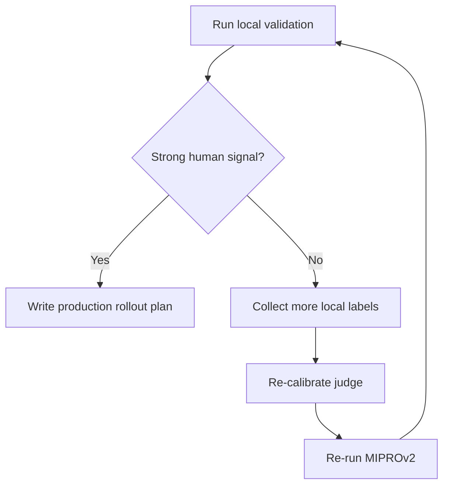

# Phase 4: Human Validation and Local Go/No-Go

Use a lightweight local comparison workflow to have human evaluators compare outputs from the optimized instruction against the baseline instruction. The goal of this phase is to decide whether the local PoC is strong enough to justify a later production rollout plan, not to deploy the prompt yet.

## Prerequisites

Before starting this phase, verify:

- [ ] Phase 3 is complete (all gating conditions met)
- [ ] A new **inactive** `LLMPrompt` row exists with the DSPy-optimized instruction for readings. Verify this by tracking the specific prompt ID created in Phase 3 rather than matching on `role`
- [ ] The current **active** `LLMPrompt` for readings exists (baseline). Verify: `LLMPrompt.objects.filter(active=True, applies_to='readings').exists()`
- [ ] A local comparison workflow from Phase 1 is functional. This may be the existing `compare_reading_prompts` admin page, a lightly extended local view, or a minimal custom validation flow
- [ ] At least 2 staff evaluators are available for the validation round (to reduce individual bias)
- [ ] There are at least 20 `Reading` objects in the database with diverse passage references (different books, OT/NT mix, narrative vs. epistolary)

## What to Do

### 1. Generate Validation Outputs

Create a management command or script to generate contexts from both the baseline and optimized prompts for a set of diverse local readings.

#### Select Validation Readings

Pick ~20 readings that are diverse and representative:

```python
from hub.models import Reading

# SQLite-safe local selection:
validation_readings = list(
    Reading.objects
    .order_by("?")[:30]
)

# Then narrow manually or in Python to a diverse set of ~10-20 readings.
# Avoid Postgres-only patterns such as distinct("book") in the local PoC.
```

Prefer readings that were NOT in the optimization training set, to test generalization.

#### Generate Contexts with Both Prompts

```python
from hub.models import LLMPrompt, ReadingContext

baseline_prompt = LLMPrompt.objects.filter(active=True, applies_to="readings").first()
optimized_prompt = LLMPrompt.objects.get(pk=optimized_prompt_id)
validation_run_id = "opt_v1"

for reading in validation_readings:
    # Generate baseline context
    baseline_service = baseline_prompt.get_llm_service()
    baseline_text = baseline_service.generate_context(reading, baseline_prompt)
    if baseline_text:
        baseline_ctx = ReadingContext.objects.create(
            reading=reading,
            text=baseline_text,
            prompt=baseline_prompt,
            active=False,  # don't disturb production
        )

    # Generate optimized context
    optimized_service = optimized_prompt.get_llm_service()
    optimized_text = optimized_service.generate_context(reading, optimized_prompt)
    if optimized_text:
        optimized_ctx = ReadingContext.objects.create(
            reading=reading,
            text=optimized_text,
            prompt=optimized_prompt,
            active=False,
        )
```

This creates paired contexts for each reading -- one from each prompt. Both are stored as inactive `ReadingContext` rows with their respective `prompt` FKs.

Important: this validation round must compare the exact artifact produced in Phase 3, which is the optimized `LLMPrompt.prompt` text under the existing runtime. Do not silently swap in the saved DSPy JSON program here unless you explicitly change the serving architecture and update the plan.

### 2. Run Local Comparisons

Use the smallest comparison workflow that gives you credible local evidence. For the first PoC:

- **Preferred**: blinded A/B comparison with randomized ordering
- **Acceptable for an initial PoC**: semi-blinded comparison if full blinding would substantially delay the experiment
- **Multiple evaluators**: Each pair should ideally be rated by at least 2 evaluators to measure inter-rater agreement.
- **No self-evaluation**: If the person who ran the optimization also does validation, they should not be the only evaluator.

#### Workflow for Evaluators

1. Staff evaluator opens the local comparison workflow.
2. For each validation reading:
   - The page or script shows the passage reference and two contexts
   - The evaluator selects: "Prefer A", "Prefer B", or "Tie"
   - Optional: free-text explanation of why
3. Results are persisted in `ReadingContextComparison` if that model exists, or captured in another durable local record and then consolidated into the database before analysis

#### Queuing Validation Comparisons

To ensure the comparison view shows the correct paired contexts rather than arbitrary outputs, either:

**Option A**: Create a queryset filter in the comparison view that specifically pulls pairs where one context's `prompt` is the baseline and the other's is the optimized prompt:

```python
from hub.models import ReadingContext

# Find readings that have both a baseline and optimized context
validation_pairs = []
for reading in validation_readings:
    baseline_ctx = reading.contexts.filter(prompt=baseline_prompt, active=False).first()
    optimized_ctx = reading.contexts.filter(prompt=optimized_prompt, active=False).first()
    if baseline_ctx and optimized_ctx:
        validation_pairs.append((reading, baseline_ctx, optimized_ctx))
```

**Option B**: Pre-create `ReadingContextComparison` records with `preferred=""` (blank), `comparison_type="validation"`, and the current `validation_run_id`, and have the UI fill them in. This approach avoids complex queryset logic.

### 3. Analyze Results

After evaluators complete the comparisons, analyze the data:

```python
from hub.models import ReadingContextComparison

# Get comparisons from this validation round only
optimized_prompt_id = optimized_prompt.id

comparisons = ReadingContextComparison.objects.filter(
    comparison_type="validation",
    validation_run_id=validation_run_id,
    prompt_a_id__in=[baseline_prompt.id, optimized_prompt_id],
    prompt_b_id__in=[baseline_prompt.id, optimized_prompt_id],
)

wins = {"baseline": 0, "optimized": 0, "tie": 0}

for comp in comparisons:
    # Determine which context was which
    if comp.context_a.prompt_id == optimized_prompt_id:
        optimized_side = "a"
    else:
        optimized_side = "b"

    if comp.preferred == "tie":
        wins["tie"] += 1
    elif comp.preferred == optimized_side:
        wins["optimized"] += 1
    else:
        wins["baseline"] += 1

total = sum(wins.values())
print(f"Results ({total} comparisons):")
print(f"  Optimized wins: {wins['optimized']} ({wins['optimized']/total*100:.0f}%)")
print(f"  Baseline wins:  {wins['baseline']} ({wins['baseline']/total*100:.0f}%)")
print(f"  Ties:           {wins['tie']} ({wins['tie']/total*100:.0f}%)")

# Win rate excluding ties
non_tie = wins["optimized"] + wins["baseline"]
if non_tie > 0:
    win_rate = wins["optimized"] / non_tie
    print(f"  Win rate (excl. ties): {win_rate*100:.0f}%")
```

### 4. Make the Local PoC Decision

#### Strong Signal

If the optimized prompt is preferred in **>= 60% of non-tie comparisons** (or >= 55% with >= 20 non-tie comparisons), treat the PoC as successful enough to justify production rollout planning.

At this point:

1. Keep the optimized `LLMPrompt` inactive in the local environment.
2. Document which prompt ID won and why.
3. Capture representative wins/losses that should inform a later cloud deployment and activation plan.

#### Weak Signal or No Signal

If the optimized prompt does not win decisively:

1. Review the comparisons and look for patterns in the baseline wins.
2. Collect more labels locally.
3. Re-calibrate the judge if the failures suggest judge bias.
4. Re-optimize with different settings only after the failure mode is understood.

### 5. Defer Production Rollout Work

After the local PoC, one of two things should happen:

1. **If the PoC is strong**: write a separate production rollout plan covering activation, monitoring, rollback, and cloud-environment concerns.
2. **If the PoC is weak**: keep iterating locally until the evidence is clearer.



## Gating Conditions for Success

This phase is complete for the **local PoC** when ALL of the following are true:

- [ ] **Validation outputs generated locally**: At least 10-20 readings have paired contexts (one from baseline, one from optimized prompt) stored as inactive `ReadingContext` rows
- [ ] **Comparisons completed**: At least 10-20 local comparisons exist for the validation pairs, ideally from at least 2 different evaluators, all tagged with the same `validation_run_id` if DB-backed persistence is used
- [ ] **Results analyzed**: Win/loss/tie counts are computed and printed
- [ ] **Decision documented**: Either the optimized prompt looks strong enough to justify a separate production rollout plan, or the next local iteration is clearly defined
- [ ] **Local artifact preserved**: The specific optimized `LLMPrompt` from Phase 3 remains identifiable and inactive for future rollout work
- [ ] **Relevant tests pass**: Run focused Django tests via the container, for example `docker exec bahk_devcontainer-app-1 python manage.py test tests.unit.hub --settings=tests.test_settings`
